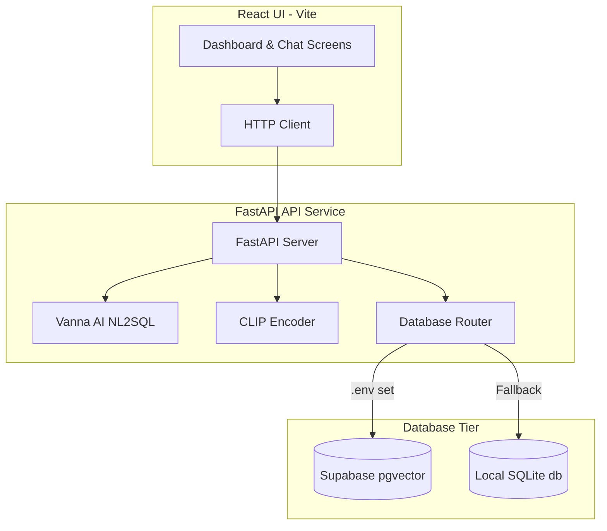

# Aura ERP Exploration Platform

Aura ERP is an AI-powered Enterprise Resource Planning (ERP) platform designed for the garment manufacturing and retail supply chain. It features natural language querying (NL2SQL), multi-filter structured catalog searches, CLIP-based image similarity search, and a beautiful dashboard showing sales trends and statistics.

---

## 🏗️ System Architecture

The application is structured into three clean, decoupled layers:



### 1. Database Tier
- **Supabase (PostgreSQL):** Production database utilizing `pgvector` for storing 512-dimension image vectors, and native Postgres B-tree indexes for structured columns.
- **SQLite Fallback:** If Supabase credentials are not found in the `.env` file, the backend automatically reads the schema and seed files, adapts Postgres-specific SQL dialects to SQLite on the fly, and runs completely locally out of the box.

### 2. Backend Tier (FastAPI)
- **Vanna AI & Regex Fallback:** Handles Natural Language questions. If LLM keys are provided, it compiles requests into SQL using Vanna. Otherwise, a regex rule-mapper resolves standard ERP requests.
- **Image Vector Search:** Employs CLIP (`clip-ViT-B-32`) to generate 512-dimensional garment embeddings. In SQLite fallback mode, cosine similarity is computed in pure Python using NumPy; in Supabase mode, it uses the database's `<=>` operator.

### 3. Frontend Tier (React)
- Scaffolds with **Vite** for fast HMR.
- Uses **Vanilla CSS Variables** to build a modern dark-mode glassmorphic interface, including custom-drawn HTML charts for visual analytics.

---

## 📂 Codebase Directory Structure

```text
ERP/
├── database/
│   ├── schema.sql           # Database schema DDL
│   ├── seed.sql             # 1,500+ SQL INSERT statements
│   ├── seed_generator.js    # Node generator script
│   ├── seed_data.py         # Python generator script
│   └── README.md            # Supabase import instructions
├── backend/
│   ├── app/
│   │   ├── main.py          # FastAPI application routes
│   │   ├── config.py        # Settings loader
│   │   ├── database.py      # Dual connection adapter
│   │   ├── vector_helper.py # Image similarity encoder
│   │   └── ai_helper.py     # NL2SQL & Answer generator
│   ├── requirements.txt     # Python packages
│   └── .env                 # Local variables
└── frontend/
    ├── src/
    │   ├── components/
    │   │   ├── Dashboard.jsx     # Overview & trends
    │   │   ├── NLQuery.jsx       # AI natural language chat
    │   │   ├── ProductSearch.jsx # Faceted side panel filters
    │   │   ├── ImageSearch.jsx   # Vector drag-n-drop similarity
    │   │   └── GoodsExplorer.jsx # Specifications spec gallery
    │   ├── App.jsx               # Navigation coordinator
    │   └── index.css             # Glassmorphism styling tokens
    └── package.json
```

---

## 🚀 How to Run the Project

### 1. Database Setup (Supabase)
Please check the detailed guide inside the [database/README.md](file:///C:/Users/laksh/.gemini/antigravity/scratch/ERP/database/README.md) folder to create your Supabase tables and import the generated `seed.sql` dump.

### 2. Backend Service (FastAPI)
Navigate to the `backend` folder, create a virtual environment, install requirements, and run the dev server:

```bash
cd backend

# If using uv (recommended):
uv pip install -r requirements.txt
uv run uvicorn app.main:app --reload

# If using standard python:
python -m venv venv
source venv/bin/activate  # On Windows: venv\Scripts\activate
pip install -r requirements.txt
uvicorn app.main:app --reload
```

*Note: Without a `.env` file, the backend will auto-create and seed `database/erp_local.db` using SQLite and run fully locally.*

### 3. Frontend Dashboard (React)
Navigate to the `frontend` folder, install dependencies, and run the Vite dev server:

```bash
cd frontend
npm install
npm run dev
```

Open your browser and visit: `http://localhost:5173`.

---

## 🛠️ API Specifications

### `GET /api/stats`
Returns aggregated count totals across Finished Goods, Suppliers, Buyers, Orders, and Revenue, alongside last-6-months invoicing trend metrics.
- **Response:**
  ```json
  {
    "totals": { "finished_goods": 200, "suppliers": 10, "buyers": 20, "sales_orders": 600, "revenue_inr": 234567.89 },
    "revenue_trend": [ { "month": "2026-01", "revenue": 45000.0, "count": 25 } ],
    "categories": [ { "category": "Jacket", "count": 28 } ]
  }
  ```

### `POST /api/query`
Processes natural language queries, compiles to SQL, executes against active database, and generates text narrative answers.
- **Request Body:** `{ "question": "Show pending invoices above ₹1,000" }`
- **Response:**
  ```json
  {
    "question": "Show pending invoices above ₹1,000",
    "sql": "SELECT ... FROM sales_invoices WHERE payment_status = 'Pending' ...",
    "columns": ["invoice_number", "amount_inr", "payment_status"],
    "results": [ { "invoice_number": "INV-20005", "amount_inr": 1250.00, "payment_status": "Pending" } ],
    "answer": "Found 1 pending invoice totaling ₹1,250.00..."
  }
  ```

### `GET /api/search`
Retrieves products based on filters. Supports search keywords (`q`), `category`, `fabric`, `min_gsm`, `max_gsm`, sorting, and pagination.

### `POST /api/search-image`
Uploads a binary image or submits a `text_fallback` query to return the top 8 visually matching styles from the database via cosine similarity.
